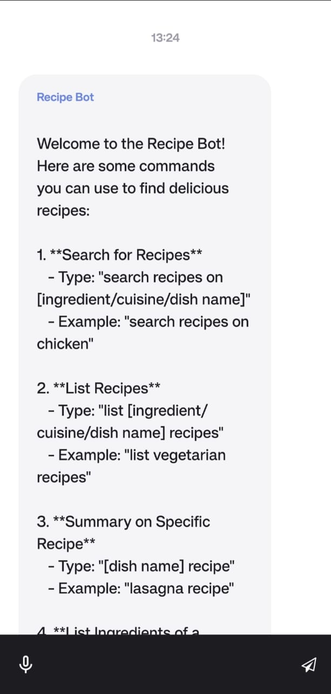
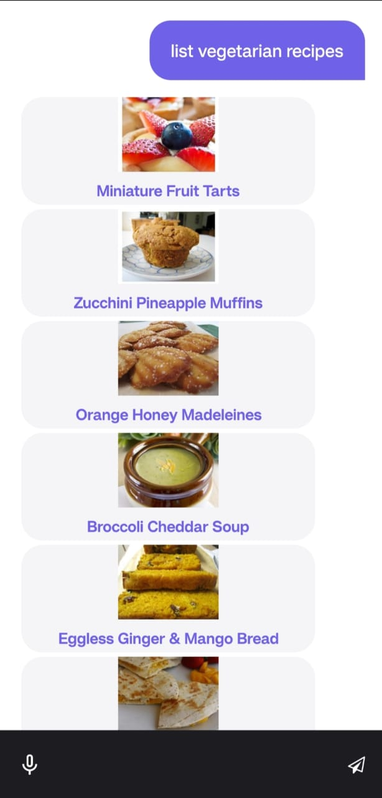

# Recipe Bot

Recipe Bot is a React Native application that helps users find delicious recipes and get cooking instructions. It
includes features such as voice recognition for commands, chat interface for interactions, and various commands to
search, list, and get details about recipes.

## Table of Contents

- [Installation](#installation)
- [Usage](#usage)
- [Commands](#commands)
- [Components](#components)
- [APIs](#apis)
- [License](#license)

## Installation

To set up the project locally, follow these steps:

1. Clone the repository:
    ```bash
    git clone https://github.com/yourusername/recipe-bot.git
    cd recipe-bot
    ```

2. Install dependencies:
    ```bash
    yarn install
    ```

3. Run the project:
    ```bash
    yarn run start
    ```

4. To run the app on an emulator or device:
    ```bash
    npx react-native run-android
    # or
    npx react-native run-ios
    ```

## Usage

Once the app is running, you can interact with the Recipe Bot via the chat interface. You can type commands or use the
voice recognition feature to search for recipes, get ingredient lists, or instructions on how to make a dish.

## Commands

Here are some commands you can use to interact with the Recipe Bot:

1. **Search for Recipes**
    - Command: `search recipes on [ingredient/cuisine/dish name]`
    - Example: `search recipes on chicken`

2. **List Recipes**
    - Command: `list [ingredient/cuisine/dish name] recipes`
    - Example: `list vegetarian recipes`

3. **Summary on Specific Recipe**
    - Command: `[dish name] recipe`
    - Example: `lasagna recipe`

4. **List Ingredients of a Recipe**
    - Command: `ingredients for [dish name]`
    - Example: `ingredients for apple pie`

5. **Instructions on How to Make a Recipe**
    - Command: `how to make [dish name]`
    - Example: `how to make brownies`

## Components

### App

The main component that sets up the application environment, including safe area context and status bar configuration.

### NavigationView

Sets up the bottom tab navigator and includes the `ChatBot` screen as one of the tabs.

### ChatBot

Manages the chatbot interface, handling user messages, voice recognition, and recipe information.

### Input

Provides a text input field with voice recognition capabilities.

### RecipeListItem

Displays a recipe item with its title and image.

### RecipeInfoItem

Displays detailed information about a recipe, including its title, image, and summary.

### RecipeIngredientItem

Displays a list of ingredients for a recipe.

### RecipeInstructionItem

Displays the instructions for a recipe.

## APIs

### Recipe

Handles interactions with the recipe API to search for recipes, get information, ingredients, and instructions.

## HOOKS

### useError

A custom hook to manage error state.

### useBoolean

A custom hook to manage boolean state.

## Screenshots

To give you a better idea of what the app looks like, here are some screenshots:

<p float="left">
  
  
</p>

## License

This project is licensed under the MIT License.
